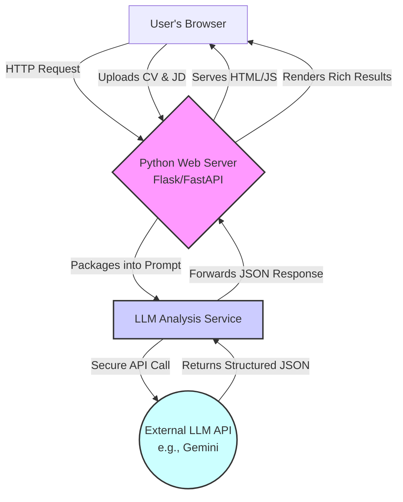

# CV Analyzer: Requirements & Acceptance Criteria (LLM-Powered)

## 1. Overview

This document outlines the requirements for a prototype of a CV Analysis Application. The primary goal is to analyze a candidate's CV against a job description and produce a detailed suitability analysis. This prototype will leverage a Large Language Model (LLM) as its core analysis engine to provide deep semantic understanding and rich, structured output. The architecture is designed for scalability and future integration.

## 2. Proposed High-Level Architecture

The architecture is centered around a Python backend that orchestrates the data flow and calls an external LLM API to perform the analysis.

- **Frontend**: A single-page web interface (built with Flask/FastAPI) where a user can input a job description and upload a CV.

- **Backend API**: A Python (Flask/FastAPI) backend that serves the frontend, handles file uploads, and exposes an `/analyze` endpoint.

- **LLM Analysis Service (Core Logic)**: This service does not perform NLP locally. Instead, it:
  - **Parses CV**: Extracts plain text from uploaded .pdf or .docx files.
  - **Constructs Prompt**: Creates a carefully engineered prompt containing the job description, the CV text, and specific instructions for the LLM.
  - **Calls LLM API**: Sends the prompt to an external LLM API (e.g., Google's Gemini API).
  - **Parses Response**: Receives a structured JSON response from the LLM and forwards it to the frontend.

- **Deployment**: The application will be containerized using Docker for easy deployment to cloud services like Render or AWS.



## 3. LLM Interaction: The Core Engine

The "intelligence" of our application comes from how we instruct the LLM. The backend will construct a prompt and request a JSON object as a response.

### Example Prompt Template:

```
Analyze the following CV against the provided Job Description. Provide your response as a valid JSON object with the following keys: "suitability_score", "scoring_rationale", "matching_skills", and "missing_skills".

- "suitability_score": An integer from 0 to 100 on how well the candidate matches the role.
- "scoring_rationale": A 2-3 sentence explanation for the score, highlighting key strengths and weaknesses.
- "matching_skills": A JSON array of strings listing skills/experiences present in both the CV and Job Description.
- "missing_skills": A JSON array of strings listing important skills/requirements from the Job Description that are absent from the CV.

**Job Description:**
"""
{job_description_text}
"""

**CV Text:**
"""
{cv_text}
"""
```

## 4. User Stories & Acceptance Criteria

| User Story | Criteria |
|------------|----------|
| **1. Provide Job Description** | **GIVEN** I am on the application page<br/>**WHEN** I look at the interface<br/>**THEN** I see a clearly labeled text area for the "Job Description". |
| **2. Provide Candidate CV** | **GIVEN** I am on the application page<br/>**WHEN** I look at the interface<br/>**THEN** I see a clearly labeled "Upload CV" button that accepts .pdf and .docx files. |
| **3. Trigger Analysis** | **GIVEN** I have provided a Job Description and uploaded a CV<br/>**WHEN** I click the "Analyze" button<br/>**THEN** the system initiates the API call.<br/>**AND** a loading indicator appears while waiting for the LLM response. |
| **4. View Rich Results** | **GIVEN** the LLM analysis is complete<br/>**WHEN** the results are displayed<br/>**THEN** I must see a clear Suitability Score (e.g., "85%").<br/>**AND** I must see a Scoring Rationale section explaining the score.<br/>**AND** I must see a list of Matching Skills found.<br/>**AND** I must see a list of Missing Skills or areas for improvement. |

## 5. Non-Functional Requirements

- **API Key Management**: API keys for the LLM service must be stored securely (e.g., as environment variables) and not hardcoded in the source code.

- **Scalability**: The backend remains stateless, allowing it to be scaled horizontally. The primary bottleneck will be the LLM's API response time.

- **Error Handling**:
  - The UI must show an error if the CV file format is unsupported.
  - The UI must show a user-friendly error if the LLM API call fails (e.g., due to a network issue, invalid API key, or the service being down).
