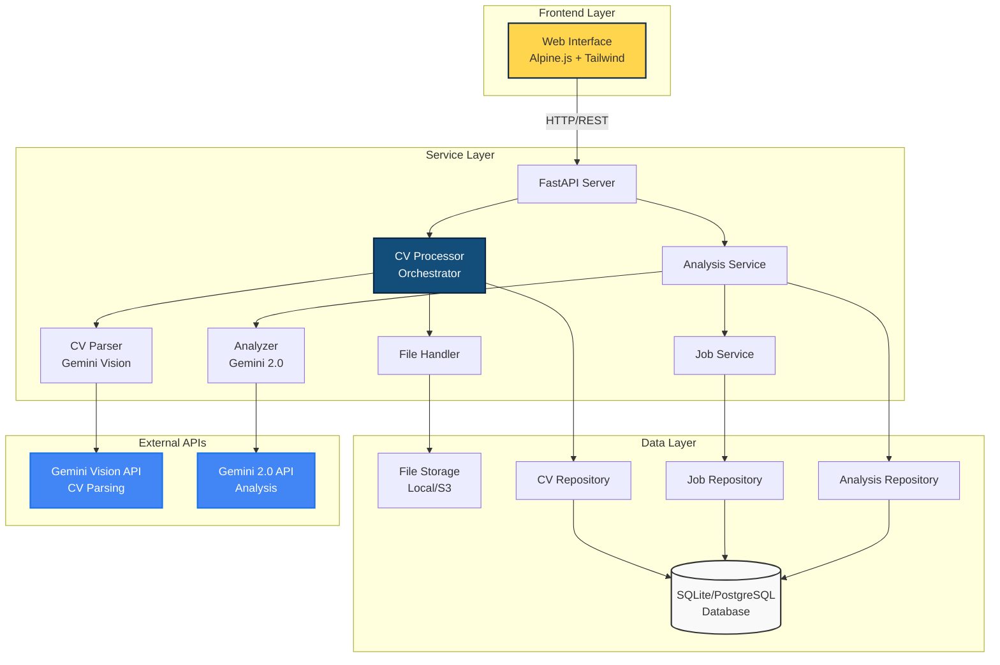
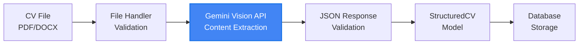
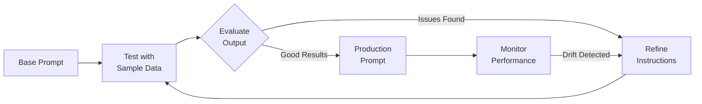
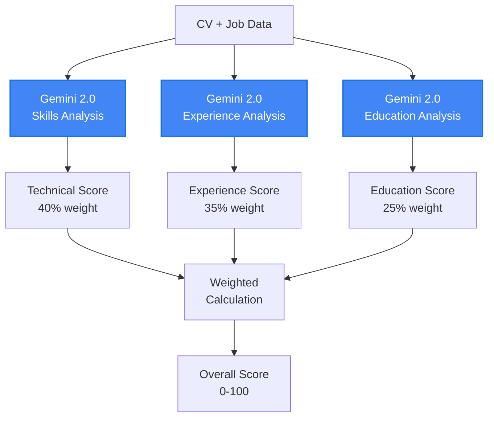
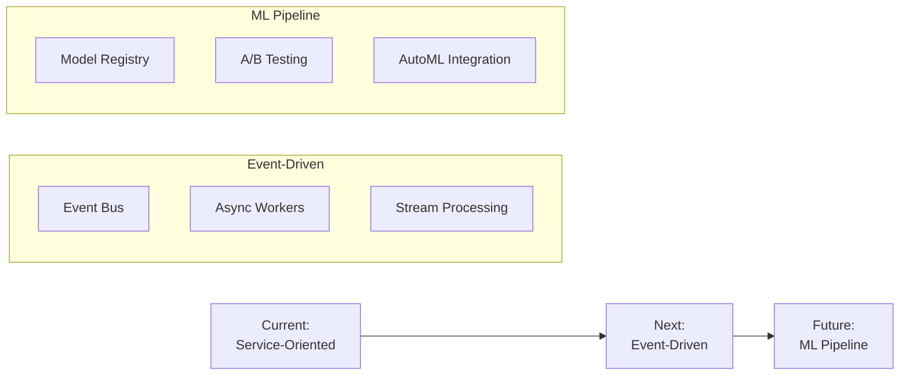

# AI-Powered Resume-Job Matching System: Technical Architecture & Implementation

## Executive Summary

**CV Analyzer** is an LLM-powered application that performs semantic analysis between resumes and job descriptions, providing quantitative matching scores and actionable insights.

### Key Capabilities
- **Intelligent Document Processing**: Gemini Vision API for CV parsing
- **Semantic Analysis**: LLM-based deep understanding of skills & experience
- **Structured Output**: JSON-formatted analysis with scoring metrics
- **Scalable Architecture**: Stateless backend with external LLM API integration

### Tech Stack
- **Backend**: Python, FastAPI, SQLAlchemy
- **Frontend**: HTML5, Alpine.js, Tailwind CSS
- **AI/ML**: Google Gemini API (Vision & Text)
- **Database**: SQLite (dev), PostgreSQL (prod-ready)

---

## System Architecture



### Core Service Architecture

The application follows a modular service architecture with clear separation of concerns:

1. **CV Processor** (`cv_processor.py`): Orchestrates the entire CV upload workflow
2. **File Handler** (`file_handler.py`): Manages file operations and validation
3. **CV Parser** (`cv_parser.py`): Uses Gemini Vision API to extract structured data
4. **Analysis Service** (`analysis_service.py`): Coordinates CV-job matching analysis
5. **Analyzer** (`analyzer.py`): Performs deep semantic analysis using Gemini 2.0
6. **Job Description Service** (`job_description_service.py`): Manages job postings

### Request Flow
1. **Upload**: User uploads CV via drag-and-drop interface
2. **Process**: CV Processor orchestrates file handling and parsing
3. **Parse**: Gemini Vision API extracts structured data from CV
4. **Analyze**: Gemini 2.0 API performs semantic matching
5. **Store**: Results cached in database via repositories
6. **Display**: Rich UI presents scores & insights

---

## CV Parsing Module: Gemini Vision Integration

### Architecture
```python
# Actual implementation flow
cv_file → FileHandler.save() → CVParser.parse_with_gemini() → StructuredCV
```

### Implementation Details

#### 1. **Gemini Vision API Integration**
```python
class GeminiCVParser:
    def __init__(self):
        self.client = genai.Client(api_key=api_key)
        self.model = 'gemini-1.5-flash'
```

#### 2. **Intelligent Parsing with Retry Logic**
- Sends CV image/PDF directly to Gemini Vision
- Uses carefully crafted prompts for structured extraction
- Implements exponential backoff for robustness
- Returns both structured data and raw JSON

#### 3. **Structured Data Extraction**
The parser uses Gemini to identify and extract:
- **Contact Information**: Name, email, phone, social profiles
- **Professional Summary**: Executive overview
- **Experience**: Companies, roles, achievements with semantic understanding
- **Education**: Degrees, institutions, academic achievements
- **Skills**: Categorized technical skills (Programming, Frameworks, Databases, etc.)
- **Projects & Certifications**: With technology mapping

### Parsing Strategy


---

## Prompt Engineering: The Intelligence Layer

### Overview

Prompt engineering is the core of our LLM-first architecture. We use two distinct prompting strategies:
1. **Structured Extraction Prompts** for CV parsing (Gemini Vision)
2. **Analytical Reasoning Prompts** for job matching (Gemini 2.0)

### CV Parsing Prompt Strategy

The CV parser uses a detailed, schema-driven prompt that ensures consistent output:

```python
def _create_extraction_prompt(self) -> str:
    return """
    You are an expert CV/Resume parser. Extract ALL information 
    from the provided document and return it as a valid JSON object 
    following this exact schema...
    
    **IMPORTANT INSTRUCTIONS:**
    1. Return ONLY valid JSON - no markdown, no explanations
    2. Use null for missing optional fields, empty arrays [] for missing lists
    3. Extract dates in YYYY-MM format when possible
    4. Categorize technical skills appropriately
    5. Differentiate between responsibilities and achievements
    """
```

#### Key Techniques:
- **Role Definition**: "You are an expert CV/Resume parser"
- **Clear Instructions**: Numbered, specific directives
- **Schema Enforcement**: Exact JSON structure provided
- **Output Formatting**: Explicit "ONLY valid JSON" requirement
- **Edge Case Handling**: Instructions for missing data

### Analysis Prompt Engineering

The analyzer uses multi-stage prompting for comprehensive evaluation:

#### 1. **Skills Analysis Prompt**
```python
skill_analysis_prompt = f"""
Analyze the skills match between this CV and job requirements.

CV Skills: {json.dumps(list(cv_skills))}
Required Skills: {json.dumps(job.required_skills)}

Identify:
1. Direct skill matches
2. Related/transferable skills that could apply
3. Critical gaps
4. Hidden strengths not explicitly listed

Return a JSON object with:
{{
    "strong_matches": ["skills that strongly match"],
    "partial_matches": ["skills that partially match"],
    "critical_gaps": ["important missing skills"],
    "transferable_skills": ["CV skills that could transfer"],
    "skill_strength_rating": "weak/moderate/strong"
}}
"""
```

#### 2. **Experience Analysis Prompt**
```python
experience_prompt = f"""
Analyze how well this candidate's experience matches the job.

Candidate Experience:
{json.dumps(experience_summary)}

Job Requirements:
- Title: {job.job_title}
- Level: {job.experience_level}
- Key Responsibilities: {json.dumps(job.responsibilities[:5])}

Analyze:
1. Role similarity and progression
2. Industry/domain relevance
3. Responsibility overlap
4. Achievement quality
5. Career trajectory

Return JSON with specific metrics...
"""
```

#### 3. **Overall Suitability Prompt**
```python
context = f"""
Analyze this candidate's overall suitability for the position.

[Context Summary]

Provide:
1. Executive summary of fit (2-3 sentences)
2. Top 3-5 specific recommendations
3. Any red flags or concerns
4. Overall hire recommendation

Return JSON:
{{
    "rationale": "executive summary",
    "recommendations": ["specific actionable recommendations"],
    "red_flags": ["concerns or gaps"],
    "hire_recommendation": "strong yes/yes/maybe/no"
}}
"""
```

### Prompt Engineering Best Practices

1. **Structured Output Requirements**
   - Always specify exact JSON schema
   - Use consistent key names across prompts
   - Provide example values for clarity

2. **Context Optimization**
   - Include only relevant information
   - Pre-process data to reduce token usage
   - Use summaries for long content

3. **Instruction Clarity**
   - Number instructions for easy reference
   - Use imperative language ("Analyze", "Identify", "Return")
   - Separate instructions from data

4. **Error Handling**
   ```python
   def _extract_json_from_response(self, response_text: str) -> str:
       # Handle various response formats
       # Strip markdown, find JSON boundaries
       # Validate before parsing
   ```

5. **Temperature Control**
   - CV Parsing: `temperature=0.3` (consistency)
   - Analysis: `temperature=0.3` (reliability)
   - Lower temperature = more deterministic output

### Prompt Evolution Strategy



### Results of Effective Prompting

- **95%+ JSON Parse Success Rate**: Clear formatting instructions
- **Consistent Scoring**: Structured rubrics in prompts
- **Rich Insights**: Multi-stage analysis approach
- **Actionable Recommendations**: Specific output requirements

---

## Analysis Module Architecture

### Multi-Stage Analysis Pipeline

```python
async def analyze_cv_for_job(cv: StructuredCV, job: StructuredJobDescription):
    # Stage 1: Skills Analysis
    skills_analysis = await _analyze_skills(cv, job)
    
    # Stage 2: Experience Analysis
    experience_analysis = await _analyze_experience(cv, job)
    
    # Stage 3: Education Analysis
    education_analysis = await _analyze_education(cv, job)
    
    # Stage 4: Overall Suitability
    overall_analysis = await _analyze_overall_suitability(...)
    
    return AnalysisResponse(...)
```

### Deep Semantic Analysis

The Analyzer uses Gemini 2.0 for:

1. **Skills Matching**
   - Direct skill matches
   - Transferable skills identification
   - Hidden strengths discovery
   - Critical gap analysis

2. **Experience Evaluation**
   - Role similarity assessment
   - Industry relevance scoring
   - Career progression analysis
   - Achievement quality rating

3. **Holistic Scoring**
   - Technical Score (40% weight)
   - Experience Score (35% weight)
   - Education Score (25% weight)

### Scoring Algorithm



---

## Data Model & Storage

### Core Entities (Simplified Schema)

```sql
-- File uploads tracking
FileUpload
├── id (PK)
├── filename
├── original_filename
├── file_size
└── upload_date

-- Parsed CV storage
CVRecord
├── id (PK)
├── file_upload_id (FK)
├── parsed_data (JSON) -- StructuredCV
├── contact_name (indexed)
└── parsed_date

-- Job descriptions
JobDescription  
├── id (PK)
├── job_title (indexed)
├── company (indexed)
├── job_data (JSON) -- StructuredJobDescription
└── is_active

-- Analysis results
Analysis
├── id (PK)
├── cv_record_id (FK)
├── job_description_id (FK)
├── suitability_score
├── analysis_data (JSON) -- AnalysisResponse
└── analysis_date
```

### Repository Pattern
- **CVRepository**: Handles CV CRUD operations
- **JobDescriptionRepository**: Manages job postings
- **AnalysisRepository**: Stores and retrieves analysis results
- **FileUploadRepository**: Tracks uploaded files

---

## Performance & Scalability

### Current Metrics
- **CV Parsing**: ~3-6 seconds (Gemini Vision API)
- **LLM Analysis**: ~4-8 seconds (Gemini 2.0 API)
- **Total E2E**: ~10-15 seconds per complete analysis

### Optimization Strategies

1. **Service Orchestration**
   ```python
   # CV Processor coordinates async operations
   async def process_cv_upload(file):
       # Parallel processing where possible
       file_task = save_file_async(file)
       parse_task = parse_cv_async(file)
       await asyncio.gather(file_task, parse_task)
   ```

2. **Smart Caching**
   - Parsed CV data cached indefinitely
   - Analysis results cached by CV+Job combination
   - Gemini responses stored for audit trail

3. **Modular Architecture Benefits**
   - Independent service scaling
   - Easy to replace/upgrade components
   - Clear error boundaries

---

## Security Considerations

### Data Protection
- **PII Handling**: CVs contain sensitive data
- **Encryption**: At-rest and in-transit
- **Access Control**: Role-based permissions
- **Audit Logging**: All actions tracked

### API Security
```python
# Gemini API key management
api_key = os.environ.get("GEMINI_API_KEY")
# Singleton pattern for API clients
# Rate limiting implemented
```

---

## Future Enhancements

### Immediate Roadmap
1. **Batch Processing**: Analyze multiple CVs against multiple jobs
2. **Advanced Filters**: Search by skills, experience level
3. **Export Functionality**: PDF reports, Excel comparisons
4. **Real-time Updates**: WebSocket for live analysis progress

### ML Improvements
1. **Fine-tuned Models**: Domain-specific Gemini fine-tuning
2. **Skill Taxonomy**: Industry-standard skill mapping
3. **Bias Detection**: Fairness in scoring algorithms
4. **Feedback Loop**: User corrections improve prompts

### Architecture Evolution


---

## Demo Flow

1. **Upload Experience** 
   - Drag & drop CV
   - Real-time parsing with Gemini Vision
   - Instant preview of extracted structured data

2. **Job Selection**
   - Search/filter loaded jobs
   - Preview job requirements
   - One-click selection

3. **Analysis Results**
   - Visual score presentation
   - Multi-stage analysis breakdown
   - Actionable recommendations
   - Detailed skill matching

---

## Technical Differentiators

### Why This Architecture?

1. **Dual LLM Strategy**: Gemini Vision for parsing, Gemini 2.0 for analysis
2. **Service-Oriented Design**: Clear separation of concerns
3. **Repository Pattern**: Clean data access layer
4. **Async-First**: Optimized for I/O-bound operations
5. **Production-Ready**: Comprehensive error handling and logging

### Key Implementation Highlights
- **Singleton Services**: Efficient resource management
- **Structured Models**: Pydantic for data validation
- **Retry Logic**: Robust external API handling
- **JSON Storage**: Flexible schema evolution

---

## Questions & Discussion

### Key Topics for Discussion:
1. Gemini API rate limits and cost optimization
2. Multi-tenant architecture considerations
3. Real-time analysis vs batch processing trade-offs
4. Integration with existing ATS/HRIS systems
5. Compliance with data privacy regulations

### Contact & Resources
- **Repository**: [GitHub Link]
- **API Documentation**: FastAPI auto-generated docs
- **Deployment Guide**: Docker + cloud provider setup

---

*Thank you for your attention. Let's explore how CV Analyzer can transform your recruitment process.*
